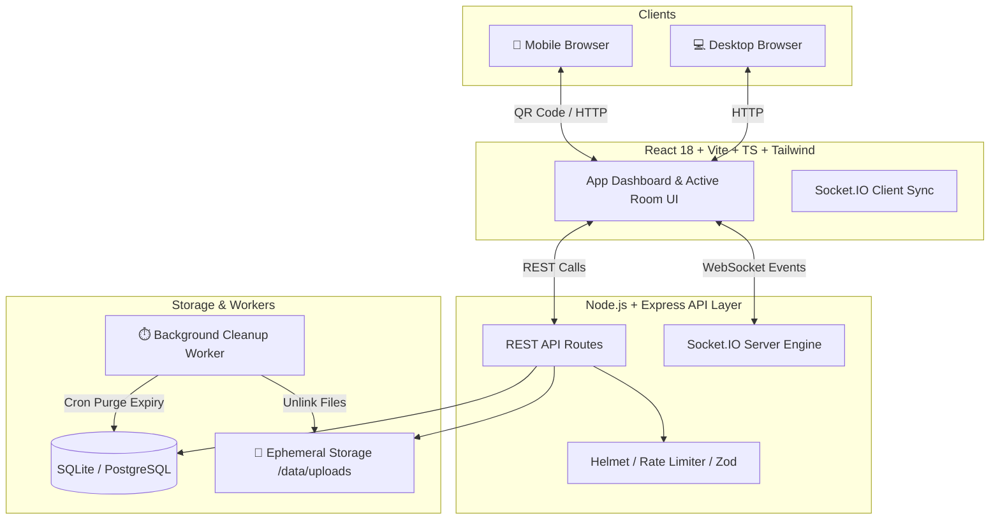

# ⚡ DropX — Ephemeral Cross-Device File & Text Sync Platform

[](https://nodejs.org/)
[](https://react.dev/)
[](https://www.typescriptlang.org/)
[](https://socket.io/)
[](https://tailwindcss.com/)
[](https://www.docker.com/)
[](LICENSE)

**DropX** is a high-performance, production-grade, temporary QR-based file and text sharing platform. Designed for instant cross-device transfers between mobile devices, laptops, and tablets without requiring accounts, logins, or permanent storage persistence.

---

## 🌟 Key Highlights & Engineering Features

- ⚡ **Zero-Friction QR Pairing**: Instantly connect secondary devices (iOS/Android/Desktop) via dynamic QR codes or 6-digit room keys.
- 🔄 **Real-Time WebSocket Sync**: Bi-directional event synchronization via **Socket.IO** with sub-50ms latency for room presence, live clipboard notes, and file activity.
- 🔒 **Zero Data Persistence Security**: Ephemeral memory model. Files and live text snippets automatically self-destruct upon room expiration or tab close with **0% database disk persistence**.
- 🛡️ **Enterprise Security Standards**: Rate limiting (Redis-backed in cluster mode), dynamic security tokens, Helmet security headers, CORS origin isolation, and Zod schema validations.
- 💾 **Dual-Storage Engine**: Supports high-speed local disk storage with streaming upload URLs and easy adaptability for S3-compatible cloud object stores.
- 🧹 **Automated Self-Healing Cleanup**: Background cron workers monitor active rooms and pending uploads, executing atomic file purges to prevent storage leaks.
- 🎨 **OLED Dark Mode Interface**: Built with React, TypeScript, Vite, and Tailwind CSS featuring dynamic glassmorphism and ambient glow responsive design.

---

## 🏗️ System Architecture



---

## 🔄 Ephemeral File & Room Lifecycle

DropX manages room state and uploaded assets using an automated state machine that prevents orphaned files and memory leaks:

```
           [ Client Requests Upload URL ]
                         │
                         ▼
                ┌─────────────────┐
                │   PENDING FILE  │ ──(Exceeds TTL: 30m)──► [ Auto-Purged ]
                └─────────────────┘
                         │
              (Upload Complete & Verified)
                         │
                         ▼
                ┌─────────────────┐
                │   ACTIVE FILE   │ ──(Download / Stream Active)
                └─────────────────┘
                         │
          ┌──────────────┴──────────────┐
          ▼                             ▼
   [ User Deletes ]             [ Room Expires ]
          │                             │
          └──────────────┬──────────────┘
                         │
                         ▼
                ┌─────────────────┐
                │ DELETED/EXPIRED │ ──► [ Local File System Unlinked ]
                └─────────────────┘
```

### Lifecycle Phases
1. **`pending` Phase**: Triggered when a client initializes a file transfer (`POST /api/rooms/:roomCode/files/upload-url`). Uncompleted uploads older than `PENDING_FILE_TTL_MINUTES` are automatically swept by background workers.
2. **Streaming Upload**: Byte streams write directly to encrypted temporary storage via streaming endpoints.
3. **Verification (`/complete`)**: Backend validates physical file existence, MIME signature, and payload size bounds before transitioning state to `active` and notifying all connected peers over WebSockets.
4. **`active` Phase**: Files are available for direct streaming or download.
5. **Self-Destruction Purge**: When a room reaches its expiration limit or all participants disconnect, background cleanup routines immediately unlink physical files from storage and wipe session metadata.

---

## 💻 Tech Stack & Tooling

| Component | Technology | Description |
| :--- | :--- | :--- |
| **Frontend Framework** | React 18, TypeScript, Vite | Fast SPA bundle with full type safety |
| **Styling & UI** | Tailwind CSS, Lucide React | OLED Dark Mode, custom glassmorphism & responsive layouts |
| **Real-Time Messaging** | Socket.IO Client | Real-time presence, clipboard sync, and room notifications |
| **Backend Runtime** | Node.js (ES Modules), Express.js | Event-driven asynchronous REST API |
| **Real-Time Engine** | Socket.IO, `@socket.io/redis-adapter` | WebSockets server supporting multi-node Redis pub/sub scaling |
| **Data & State Persistence** | SQLite3 (Dev) / PostgreSQL (Prod) | In-memory session tracking & metadata storage |
| **Security & Validation** | Zod, Helmet, Express-Rate-Limit | Strict schema validation, HTTP security headers, rate limiting |
| **Logging** | Pino, Pino-HTTP | High-performance JSON logging with pretty printing |
| **Containerization** | Docker, Docker Compose | Production container setup |

---

## ⚙️ Environment Configuration

Both frontend and backend rely on configurable environment variables. Sample files are included in the repository.

### Backend Config (`backend/.env`)

```env
PORT=3000
NODE_ENV=development

# Storage Configuration
STORAGE_PROVIDER=local
LOCAL_STORAGE_DIR=./data/uploads

# Lifecycle & Expiry Settings
ROOM_TTL_MINUTES=120
ROOM_CLEANUP_INTERVAL_MS=60000
PENDING_FILE_TTL_MINUTES=30
UPLOAD_URL_EXPIRY_SECONDS=300
DOWNLOAD_URL_EXPIRY_SECONDS=300

# Platform Limits
MAX_FILE_SIZE_MB=100
MAX_FILES_PER_ROOM=20
MAX_ROOM_STORAGE_BYTES=524288000

# CORS Security
CORS_ORIGIN=http://localhost:5173
```

---

## 🚀 Quick Start & Local Setup

### Prerequisites
- **Node.js** `>= 18.x`
- **npm** `>= 9.x`

### 1. Clone Repository
```bash
git clone https://github.com/tanmay9783/dropx.git
cd dropx
```

### 2. Start Backend Server
```bash
cd backend
npm install
npm run dev
```
- Server starts at: `http://localhost:3000`
- Health check endpoint: `http://localhost:3000/api/health`

### 3. Start Frontend Application
```bash
cd ../frontend
npm install
npm run dev
```
- Web App starts at: `http://localhost:5173`

---

## 🐳 Docker Deployment

Run the complete platform stack using Docker Compose:

```bash
docker-compose up --build -d
```

---

## 📡 API Reference & Socket Events

### Key REST Endpoints

| Method | Endpoint | Description |
| :--- | :--- | :--- |
| `POST` | `/api/rooms` | Create a new temporary room & owner security token |
| `POST` | `/api/rooms/join` | Join an existing room via 6-digit code |
| `GET` | `/api/rooms/:roomCode` | Fetch active room state & files |
| `POST` | `/api/rooms/:roomCode/files/upload-url` | Generate temporary upload authorization |
| `POST` | `/api/rooms/:roomCode/files/complete` | Confirm upload completion and notify room |
| `GET` | `/api/rooms/:roomCode/files/:fileId/download-url` | Obtain short-lived secure download token |
| `POST` | `/api/rooms/:roomCode/text` | Broadcast live text snippet / clipboard note |
| `GET` | `/api/health` | Service health status check |

### Real-Time Socket Events

| Event Name | Direction | Payload | Description |
| :--- | :--- | :--- | :--- |
| `join-room` | Client ➔ Server | `{ roomCode, socketToken }` | Connect socket to active room channel |
| `peer-joined` | Server ➔ Client | `{ participantId, totalPeers }` | Notify connected devices of new peer |
| `file-uploaded` | Server ➔ Client | `{ fileMetadata }` | Live updates when a file upload completes |
| `file-deleted` | Server ➔ Client | `{ fileId }` | Sync file removal across all connected devices |
| `text-created` | Server ➔ Client | `{ textSnippet }` | Instant live text/clipboard sync across devices |

---

## 🧪 Testing & Verification

The project includes integration tests covering room creation, file lifecycle, upload flow, and API error states:

```bash
cd backend
npm test
```

---

## 👤 Author

**Tanmay**  
- GitHub: [@tanmay9783](https://github.com/tanmay9783)  
- Focus: Full-Stack Web Development, Real-Time Distributed Systems & Security Architecture.

---

## 📄 License

This project is licensed under the [MIT License](LICENSE).
